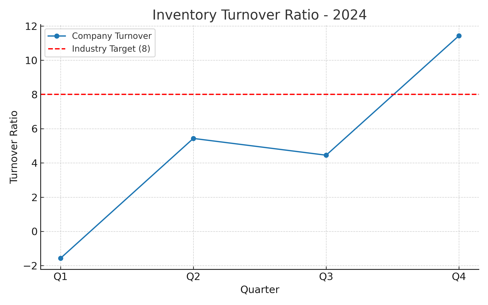

# Retail Inventory Turnover Analysis (2024)

**Analyst:** Raghul Gnanasekaran  
**Email:** 23f2002365@ds.study.iitm.ac.in  

## 📊 Key Findings
- The company’s **average inventory turnover ratio** for 2024 is **4.93**, which falls significantly short of the **industry benchmark of 8**.
- **Quarterly performance** is highly inconsistent:
  - **Q1**: -1.57 (negative turnover suggests data/reporting issues or excess buildup of obsolete stock)
  - **Q2**: 5.43 (partial recovery but still below target)
  - **Q3**: 4.45 (slight dip, signaling continued inefficiencies)
  - **Q4**: 11.43 (sharp improvement — indicates potential seasonal demand or corrective measures)
- This variability points to **unreliable demand forecasting** and **supply chain inefficiencies**.

## 🚨 Business Implications
- **Excess storage costs**: Holding onto slow-moving stock increases warehouse expenses.
- **Working capital lockup**: Tied-up inventory reduces liquidity for other business operations.
- **Customer dissatisfaction risk**: Poor forecasting may lead to stockouts in high-demand periods (e.g., Q4 surge vs. Q2-Q3 slump).

## ✅ Recommendations
1. **Optimize Supply Chain**
   - Improve vendor lead-time agreements.
   - Adopt just-in-time (JIT) practices for faster stock rotation.
2. **Enhance Demand Forecasting**
   - Use AI/ML models to predict demand seasonality more accurately.
   - Incorporate external factors (festivals, promotions, economic signals) into forecasting.
3. **Data Governance**
   - Investigate Q1 anomaly (-1.57) for reporting errors.
   - Standardize data collection to avoid negative/invalid values.
4. **Strategic Inventory Management**
   - Implement ABC analysis (high-priority items managed closely).
   - Consider clearance strategies for obsolete/slow-moving stock.

## 📈 Visualization

---

> This analysis provides the executive team with **clear visibility into quarterly turnover performance** and **actionable steps** to reach the industry target of **8** in the upcoming fiscal year.  
